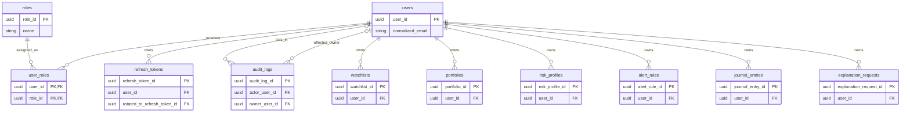
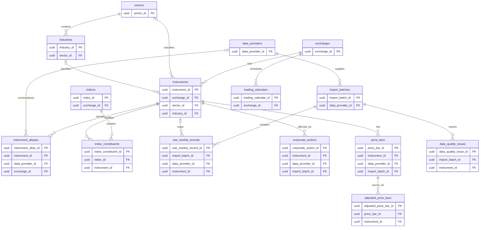
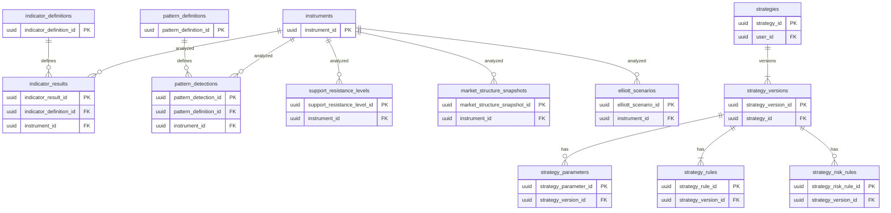
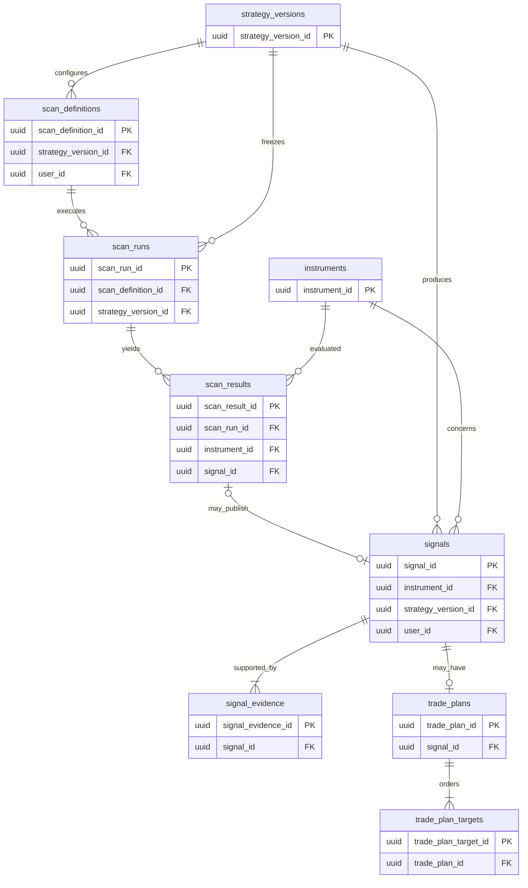
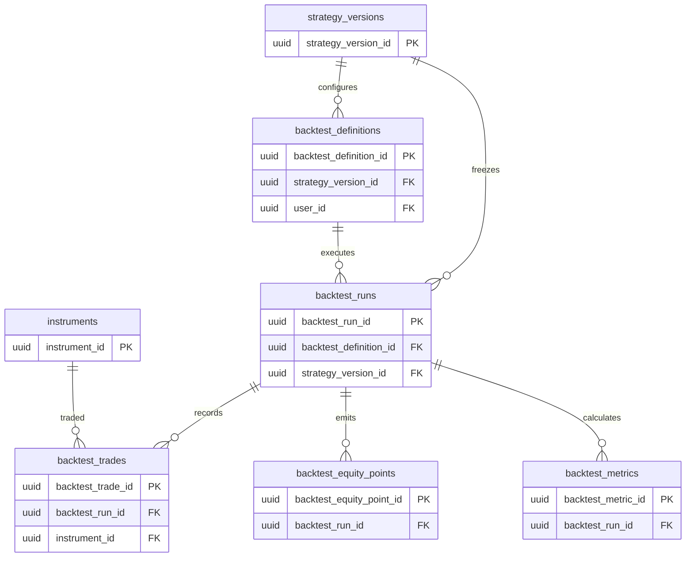
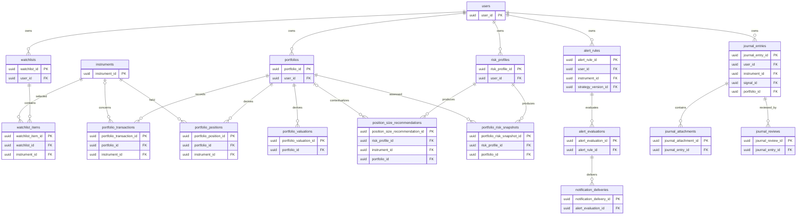
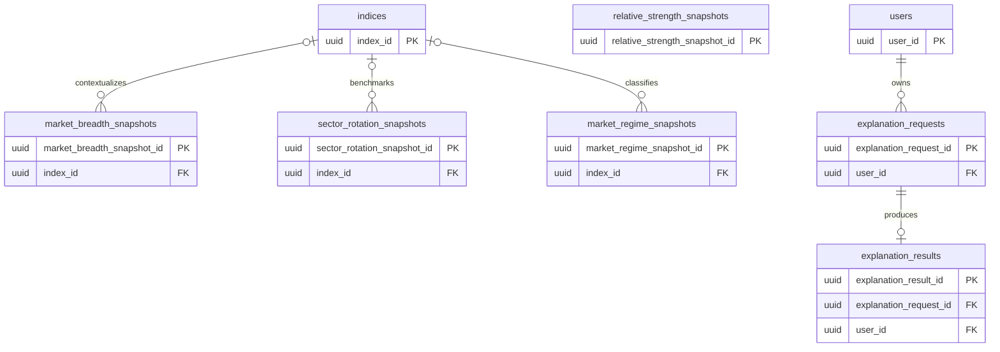

# VNStockLab ERD V1

**Status:** Frozen
**Version:** 1.0
**Date:** 2026-07-16

These conceptual diagrams use physical table names and show only major identity and relationship columns. Evidence payloads may contain validated polymorphic references that are summarized after the diagrams.

## 1. Identity and ownership

## 2. Instruments and market data

## 3. Technical analysis and strategies

## 4. Scanner, signals, and trade plans

## 5. Backtesting

## 6. Watchlists, portfolios, risk, alerts, and journal

## 7. Market intelligence and AI explanations

## Cross-domain relationship summary

- Canonical `instruments` anchor market series, technical evidence, scan results, signals, backtest trades, watchlists, portfolio records, risk calculations, alerts, and journal context.
- Immutable `strategy_versions` anchor scanner, signals, backtests, and strategy-derived alerts so all consumers use the shared Strategy Engine and canonical technical semantics.
- Provider/batch/raw/bar/action lineage flows into analytical evidence. Evidence payload references are validated at publication even where a polymorphic relational foreign key is not possible.
- User-owned aggregate roots carry `user_id`; selected children repeat it to enforce isolation and must match the root owner.
- AI requests cite immutable deterministic evidence through a frozen, versioned evidence snapshot. Results relate only to their request and never become a parent or source of analytical truth.
- Adjusted bars, analytics, positions, valuations, risk/intelligence snapshots, scan/signal/backtest outputs, and AI prose are derived; their persisted historical versions remain immutable and traceable.
