# VNStockLab Relationship Map V1

**Status:** Frozen  
**Version:** 1.0  
**Date:** 2026-07-16

## Purpose

This document describes the principal version 1 domain relationships and logical cardinalities. Cardinalities are conceptual and do not prescribe database keys, join tables, or ORM mappings.

## Principal relationships

### Identity and ownership

- One `User` has zero or more `Role` assignments, and one `Role` may be assigned to zero or more users.
- One `User` has zero or more `RefreshToken` records; each refresh token belongs to exactly one user.
- One `User` owns zero or more watchlists, portfolios, risk profiles, alert rules, journal entries, and explanation requests; every such root belongs to exactly one user.
- One `User` may act in zero or more `AuditLog` records; an audit record may use a system actor when no user initiated the event.

### Instruments

- One `Exchange` lists zero or more `Instrument` records; each listed instrument belongs to exactly one exchange.
- One `Sector` classifies zero or more instruments; an instrument has zero or one sector.
- One `Industry` belongs to exactly one sector and classifies zero or more instruments; an instrument has zero or one industry. If both classifications exist, the industry must belong to the instrument's sector.
- One `Instrument` has zero or more `InstrumentAlias` records; each alias maps to exactly one canonical instrument. An alias may optionally have one provider or exchange context, and its effective period determines when it resolves to that instrument. The same effective alias cannot resolve to conflicting instruments within the same context.
- One `Index` has zero or more time-bounded `IndexConstituent` records, and one instrument may have zero or more index memberships. Each membership joins exactly one index and one instrument.

### Market data

- One `Instrument` has zero or more `PriceBar` records and zero or more `AdjustedPriceBar` records; each bar belongs to exactly one instrument and one timeframe.
- Each `AdjustedPriceBar` derives from exactly one normalized `PriceBar`; a normalized bar may have zero or more adjusted representations across adjustment policies or versions.
- One `DataProvider` supplies zero or more `ImportBatch` records and market records; each import batch has exactly one provider.
- One `ImportBatch` contains zero or more `RawMarketRecord` records and may produce zero or more `PriceBar`, `AdjustedPriceBar`, and `DataQualityIssue` records. Every market record identifies both provider and import batch lineage.
- One `Instrument` has zero or more `CorporateAction` records; each action concerns exactly one instrument. An action may contribute to zero or more adjusted bars, while an adjusted bar may reference zero or more actions applicable to its effective timestamp.
- A `TradingCalendar` supplies zero or more sessions for an exchange or market context and is referenced when validating bar timestamps.

### Technical analysis and strategies

- One `IndicatorDefinition` produces zero or more `IndicatorResult` records; each result uses exactly one definition version.
- One instrument and one timeframe have zero or more indicator results; each result belongs to exactly one instrument, one timeframe, and one as-of timestamp.
- One `PatternDefinition` produces zero or more `PatternDetection` records; each detection uses exactly one definition and preserves its evidence.
- Instruments have zero or more pattern detections, support/resistance levels, market-structure snapshots, and Elliott scenarios.
- One `Strategy` has one or more `StrategyVersion` records; each version belongs to exactly one strategy.
- One StrategyVersion has zero or more parameters, one or more rules, and zero or more risk rules. Each of these belongs to exactly one version and is immutable with it.
- One StrategyVersion produces zero or more signals, scan results, alert evaluations, and backtest evaluations; every result references exactly one StrategyVersion.

### Scanner, signals, and backtesting

- One `ScanDefinition` has zero or more `ScanRun` records; every run uses exactly one scan definition snapshot and StrategyVersion.
- One `ScanRun` has zero or more `ScanResult` records; each result concerns exactly one instrument and evaluation context.
- One `Signal` has one or more `SignalEvidence` records and zero or one `TradePlan`; every evidence item and trade plan belongs to exactly one signal.
- One `BacktestDefinition` has zero or more `BacktestRun` records; every run freezes exactly one definition snapshot and StrategyVersion.
- One `BacktestRun` has zero or more trades, one or more equity points when simulation begins, and zero or more metrics. Every child belongs to exactly one run.

### User tools, alerts, and explanations

- One `Watchlist` has zero or more `WatchlistItem` records; each item references exactly one instrument.
- One `Portfolio` has zero or more transactions, positions, and valuations. Transactions are historical facts; positions and valuations are derived from them and point-in-time market context.
- One `RiskProfile` may produce zero or more position-size recommendations and portfolio-risk snapshots.
- One `AlertRule` has zero or more `AlertEvaluation` records. Each evaluation may have zero or more `NotificationDelivery` attempts across in-app, email, and Telegram channels. Each delivery belongs to exactly one evaluation.
- One `JournalEntry` has zero or more attachments and reviews and may reference an instrument, signal, trade plan, or portfolio context owned or accessible to the same user.
- One `ExplanationRequest` has zero or one `ExplanationResult`. A request references one or more immutable deterministic evidence records; its result explains those records without becoming their source of truth.

## Data classification

| Classification | Included records | Treatment |
| --- | --- | --- |
| Shared reference data | Exchange, Sector, Industry, Instrument, InstrumentAlias, Index, IndexConstituent, DataProvider, TradingCalendar, indicator and pattern definitions | Canonical platform data reused across users; historical and alternate instrument identities resolve to canonical instruments. |
| Shared market data | ImportBatch, RawMarketRecord, CorporateAction, PriceBar, AdjustedPriceBar, DataQualityIssue | Provider-traceable platform data; raw input is immutable and representations stay distinct. |
| User-owned data | Watchlists, portfolios, risk profiles, alert rules, journal records, explanation requests, user-owned strategies, and their children | Isolated by owning user through every operation. |
| Immutable analytical evidence | IndicatorResult, PatternDetection, support/resistance, market structure, Elliott scenarios, StrategyVersion contents, SignalEvidence, published signals, scan results, and completed backtest results | Append-only historical facts or versioned results; re-evaluation creates new records. |
| Derived snapshots | AdjustedPriceBar, PortfolioPosition, PortfolioValuation, PortfolioRiskSnapshot, and market-intelligence snapshots | Point-in-time derived representations with input and calculation lineage; never silently rewritten as another point in time. |

## Conceptual entity relationship overview

```mermaid
erDiagram
    USER ||--o{ WATCHLIST : owns
    USER ||--o{ PORTFOLIO : owns
    USER ||--o{ ALERT_RULE : owns
    USER ||--o{ JOURNAL_ENTRY : owns
    USER ||--o{ EXPLANATION_REQUEST : owns

    EXCHANGE ||--o{ INSTRUMENT : lists
    SECTOR o|--o{ INSTRUMENT : classifies
    INDUSTRY o|--o{ INSTRUMENT : classifies
    INSTRUMENT ||--o{ INSTRUMENT_ALIAS : identified_by
    INDEX ||--o{ INDEX_CONSTITUENT : contains
    INSTRUMENT ||--o{ INDEX_CONSTITUENT : participates

    DATA_PROVIDER ||--o{ IMPORT_BATCH : supplies
    IMPORT_BATCH ||--o{ RAW_MARKET_RECORD : contains
    INSTRUMENT ||--o{ PRICE_BAR : has
    PRICE_BAR ||--o{ ADJUSTED_PRICE_BAR : derives
    INSTRUMENT ||--o{ CORPORATE_ACTION : has

    INDICATOR_DEFINITION ||--o{ INDICATOR_RESULT : defines
    INSTRUMENT ||--o{ INDICATOR_RESULT : analyzed
    PATTERN_DEFINITION ||--o{ PATTERN_DETECTION : defines
    INSTRUMENT ||--o{ PATTERN_DETECTION : analyzed

    STRATEGY ||--|{ STRATEGY_VERSION : versions
    STRATEGY_VERSION ||--o{ STRATEGY_RULE : contains
    STRATEGY_VERSION ||--o{ STRATEGY_PARAMETER : contains
    STRATEGY_VERSION ||--o{ STRATEGY_RISK_RULE : contains
    STRATEGY_VERSION ||--o{ SIGNAL : produces
    SIGNAL ||--|{ SIGNAL_EVIDENCE : supported_by
    SIGNAL ||--o| TRADE_PLAN : may_have

    SCAN_DEFINITION ||--o{ SCAN_RUN : executes
    SCAN_RUN ||--o{ SCAN_RESULT : yields
    BACKTEST_DEFINITION ||--o{ BACKTEST_RUN : executes
    BACKTEST_RUN ||--o{ BACKTEST_TRADE : records
    BACKTEST_RUN ||--o{ BACKTEST_EQUITY_POINT : records
    BACKTEST_RUN ||--o{ BACKTEST_METRIC : records

    WATCHLIST ||--o{ WATCHLIST_ITEM : contains
    PORTFOLIO ||--o{ PORTFOLIO_TRANSACTION : records
    PORTFOLIO ||--o{ PORTFOLIO_POSITION : derives
    PORTFOLIO ||--o{ PORTFOLIO_VALUATION : derives
    ALERT_RULE ||--o{ ALERT_EVALUATION : evaluates
    ALERT_EVALUATION ||--o{ NOTIFICATION_DELIVERY : delivers
    JOURNAL_ENTRY ||--o{ JOURNAL_ATTACHMENT : contains
    JOURNAL_ENTRY ||--o{ JOURNAL_REVIEW : reviews
    EXPLANATION_REQUEST ||--o| EXPLANATION_RESULT : produces
```

The diagram intentionally omits many evidence references and temporal associations to remain conceptual and implementation-neutral.
